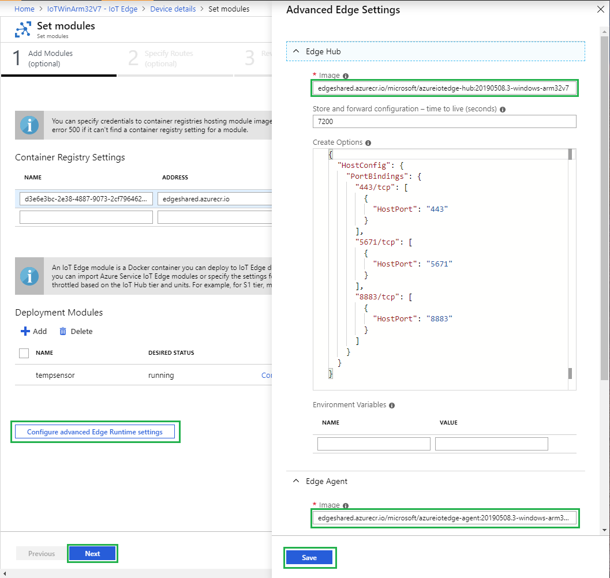

# Azure IoT Edge Windows 10 IoTCore ARM32 Preview
This document is for Azure IoT Edge Windows 10 IoTCore ARM32 Preview, the content is based on the original [iotedge quick start guide](https://docs.microsoft.com/en-us/azure/iot-edge/quickstart) and has been updated to accomodate  Windows IoTCore ARM32 specfic instructions and information. If you're working on other Windows platforms, please refer to the original document.

**Some information relates to prereleased product which may be substantially modified before it's commercially released. Microsoft makes no warranties, express or implied, with respect to the information provided here.**

# Quickstart: Deploy your first IoT Edge module from the Azure portal to a Windows device

In this quickstart, use the Azure IoT Edge cloud interface to deploy prebuilt code remotely to an IoT Edge device. To accomplish this task, first follow [IoTCore quick start](https://docs.microsoft.com/en-us/windows/iot-core/tutorials/quickstarter/devicesetup) to set up a device with IoTCore 1809 release, then you can deploy IoTEdge onto it.

In this quickstart you learn how to:

1. Create an IoT Hub.
2. Register an IoT Edge device to your IoT hub.
3. Install and start the IoT Edge runtime on your device.
4. Remotely deploy a module to an IoT Edge device and send telemetry to IoT Hub.


The module that you deploy in this quickstart is a simulated sensor that generates temperature, humidity, and pressure data. The other Azure IoT Edge tutorials build upon the work you do here by deploying modules that analyze the simulated data for business insights.

If you don't have an active Azure subscription, create a [free account](https://azure.microsoft.com/free) before you begin.

[!INCLUDE [cloud-shell-try-it.md](../../includes/cloud-shell-try-it.md)]

You use the Azure CLI to complete many of the steps in this quickstart, and Azure IoT has an extension to enable additional functionality.

Add the Azure IoT extension to the cloud shell instance.

   ```azurecli-interactive
   az extension add --name azure-cli-iot-ext
   ```

## Prerequisites

Cloud resources:

* A resource group to manage all the resources you use in this quickstart.

   ```azurecli-interactive
   az group create --name IoTEdgeResources --location westus2
   ```

IoT Edge device:

* Follow [IoTCore quick start](https://docs.microsoft.com/en-us/windows/iot-core/tutorials/quickstarter/devicesetup) to set up a device with IoTCore 1809 release
* Then set up remote powershell session [Using PowerShell for Windows IoT](https://docs.microsoft.com/en-us/windows/iot-core/connect-your-device/powershell). ps session will be used as the only way to run any scripts, commands on the IoTCore device

## Create an IoT hub

Start the quickstart by creating an IoT hub with Azure CLI.


The free level of IoT Hub works for this quickstart. If you've used IoT Hub in the past and already have a free hub created, you can use that IoT hub. Each subscription can only have one free IoT hub.

The following code creates a free **F1** hub in the resource group **IoTEdgeResources**. Replace *{hub_name}* with a unique name for your IoT hub.

   ```azurecli-interactive
   az iot hub create --resource-group IoTEdgeResources --name {hub_name} --sku F1
   ```

   If you get an error because there's already one free hub in your subscription, change the SKU to **S1**. If you get an error that the IoT Hub name isn't available, it means that someone else already has a hub with that name. Try a new name.

## Register an IoT Edge device

Register an IoT Edge device with your newly created IoT Hub.


Create a device identity for your simulated device so that it can communicate with your IoT hub. The device identity lives in the cloud, and you use a unique device connection string to associate a physical device to a device identity.

Since IoT Edge devices behave and can be managed differently than typical IoT devices, declare this identity to be for an IoT Edge device with the `--edge-enabled` flag.

1. In the Azure cloud shell, enter the following command to create a device named **myEdgeDevice** in your hub.

   ```azurecli-interactive
   az iot hub device-identity create --device-id myEdgeDevice --hub-name {hub_name} --edge-enabled
   ```

   If you get an error about iothubowner policy keys, make sure that your cloud shell is running the latest version of the azure-cli-iot-ext extension.

2. Retrieve the connection string for your device, which links your physical device with its identity in IoT Hub.

   ```azurecli-interactive
   az iot hub device-identity show-connection-string --device-id myEdgeDevice --hub-name {hub_name}
   ```

3. Copy the value of the `connectionString` key from the JSON output and save it. This value is the device connection string. You'll use this connection string to configure the IoT Edge runtime in the next section.

   
   
## Set Modules for IoTCore ARM32 Preview on the Portal
After the edge device has been created, by default it points to mcr.microsoft.com/azureiotedge-hub:1.0 to pull both the agent and the hub modules. Since Windows ARM32 is still not public yet, there is no modules for Windows ARM32 from mcr, so we need to set it to pull from the preview registry.

4 preview modules have been provided for the Windows IoTCore ARM32 preview, use username `d3e6e3bc-2e38-4887-9073-2cf796462b15` and password `71181f94-a9b9-4b98-96a8-01c4ae8dff94` to log into the container registry `edgeshared.azurecr.io`

* edgeshared.azurecr.io/microsoft/azureiotedge-agent:20190508.3-windows-arm32v7
* edgeshared.azurecr.io/microsoft/azureiotedge-hub:20190508.3-windows-arm32v7
* edgeshared.azurecr.io/microsoft/azureiotedge-diagnostics:20190508.3-windows-arm32v7
* edgeshared.azurecr.io/microsoft/azureiotedge-simulated-temperature-sensor:20190508.3-windows-arm32v7

1. Go to your IoT Hub portal, click on IoT Edge, it'll list all your IoT Edge devices, find the one you just created, click on it to open its details.
   
   
   >[!TIP]
   > You can also create new IoT Edge devices on the portal

   >[!TIP]
   > When creating the device in azure cloud shell, this argument "--edge-enabled" tells the hub the new device is IoT Edge, so the device can be found in "IoT Edge", if this argument was not used, the device will be listed under "IoT Devices" instead.
   
2. Click Set Modules to set up modules for the device
   
   
3. In the set modules page, type in the user name, password and server for the preview registry (edgeshared). Click the image to see its original content.
   
   
4. Click on "Configure Advanced Edge Runtime Settings", and set up the edgeAgent and edgeHub to the preview modules accordingly. Click Save button to save the changes, then click "Next" button to move to second step to specify routes.

edgeshared.azurecr.io/microsoft/azureiotedge-agent:20190508.3-windows-arm32v7
edgeshared.azurecr.io/microsoft/azureiotedge-hub:20190508.3-windows-arm32v7

   
   
5. Update the routes as needed, this step is optional. Click Next to step 3 "Review Deployment"

   

6. Review the deployment, click Submit button to submit the changes.

   
   
## Install and start the IoT Edge runtime

Install the Azure IoT Edge runtime on your IoT Edge device and configure it with a device connection string.


The IoT Edge runtime is deployed on all IoT Edge devices. It has three components. The **IoT Edge security daemon** starts each time an IoT Edge device boots and bootstraps the device by starting the IoT Edge agent. The **IoT Edge agent** manages deployment and monitoring of modules on the IoT Edge device, including the IoT Edge hub. The **IoT Edge hub** handles communications between modules on the IoT Edge device, and between the device and IoT Hub.

The installation script also includes a container engine called Moby that manages the container images on your IoT Edge device.

During the runtime installation, you're asked for a device connection string. Use the string that you retrieved from the Azure CLI. This string associates your physical device with the IoT Edge device identity in Azure.

### Connect to your IoT Edge device

You should have the IoTCore device connected to the network and you have its IP address for remote PS session

### Install and configure the IoT Edge service

Use PowerShell to download and install the IoT Edge runtime. Use the device connection string that you retrieved from IoT Hub to configure your device.

1. Open powershell on desktop, enter ps session to the iotcore device, password is `p@ssw0rd`
   ```powershell
   Enter-PSSession -ComputerName <IP address> -Credential <same IP address>\Administrator
   ```

2. The **Deploy-IoTEdge** command checks that your Windows machine is on a supported version, turns on the containers feature, downloads the moby runtime, and then downloads the IoT Edge runtime.

   ```powershell
   # remote powershell session to IoTCore ARM32 device
   . {Invoke-WebRequest -useb aka.ms/iotedge-winarm32} | Invoke-Expression; `
   Deploy-IoTEdge -ContainerOs Windows
   ```

3. Your machine may restart automatically. If you are prompted by the Deploy-IoTEdge command to reboot, do so now. 

4. After reboot, reconnect to the PS session

5. The **Initialize-IoTEdge** command configures the IoT Edge runtime on your device. The command defaults to manual provisioning with Windows containers. 

   ```powershell
   # remote powershell session to IoTCore ARM32 device
   . {Invoke-WebRequest -useb aka.ms/iotedge-winarm32} | Invoke-Expression; `
   Initialize-IoTEdge -AgentImage 'edgeshared.azurecr.io/microsoft/azureiotedge-agent:20190508.3-windows-arm32v7' -Username 'd3e6e3bc-2e38-4887-9073-2cf796462b15' -Password $(ConvertTo-SecureString '71181f94-a9b9-4b98-96a8-01c4ae8dff94' -AsPlainText -Force)
   ```

6. When prompted for a **DeviceConnectionString**, provide the string that you copied in the previous section. Don't include quotes around the connection string.

### View the IoT Edge runtime status

Verify that the runtime was successfully installed and configured.

1. Check the status of the IoT Edge service.

   ```powershell
   # remote powershell session to IoTCore ARM32 device
   Get-Service iotedge
   ```

2. If you need to troubleshoot the service, retrieve the service logs.

   ```powershell
   # remote powershell session to IoTCore ARM32 device
   . {Invoke-WebRequest -useb aka.ms/iotedge-winarm32} | Invoke-Expression; Get-IoTEdgeLog
   ```

3. View all the modules running on your IoT Edge device. Since the service just started for the first time, you should only see the **edgeAgent** module running. The edgeAgent module runs by default, and helps to install and start any additional modules that you deploy to your device.

   ```powershell
   # remote powershell session to IoTCore ARM32 device
   iotedge list
   ```

   

It may take a few minutes for the installation to complete and the IoT Edge agent module to start.

Your IoT Edge device is now configured. It's ready to run cloud-deployed modules.

## Deploy Simulated Temperature Sensor module

Manage your Azure IoT Edge device from the cloud to deploy a module that sends telemetry data to IoT Hub.


This module is in the marketplace and can be downaloded and installed following this document, [iot-edge-deploy-module](../../includes/iot-edge-deploy-module.md). However for Windows ARM32 preview, the module is not available in the marketplace, so you need to manually install it and point to the preview registry edgeshared.azurecr.io/microsoft/azureiotedge-simulated-temperature-sensor:20190508.3-windows-arm32v7


Similar to edgeAgent and edgeHub, once the module path is set, click Save button to save the module setting,  click Next to step 2 "Specify Routes", click Next again to step 3 "Review Depployment", then click "Save" button to save the deployment. Edge agent should pick up this and start to download the module momentarily.

## View generated data

In this quickstart, you registered an IoT Edge device and installed the IoT Edge runtime on it. Then, you used the Azure portal to deploy an IoT Edge module to run on the device without having to make changes to the device itself.

In this case, the module that you pushed creates sample data that you can use for testing. The simulated temperature sensor module generates environment data that you can use for testing later. The simulated sensor is monitoring both a machine and the environment around the machine. For example, this sensor might be in a server room, on a factory floor, or on a wind turbine. The message includes ambient temperature and humidity, machine temperature and pressure, and a timestamp. The IoT Edge tutorials use the data created by this module as test data for analytics.

Confirm that the module deployed from the cloud is running on your IoT Edge device.

```powershell
# remote powershell session to IoTCore ARM32 device
iotedge list
```

   

View the messages being sent from the temperature sensor module to the cloud. 

```powershell
# remote powershell session to IoTCore ARM32 device
iotedge logs SimulatedTemperatureSensor -f
```

   >[!TIP]
   >IoT Edge commands are case-sensitive when referring to module names.

   

You can also watch the messages arrive at your IoT hub by using the [Azure IoT Hub Toolkit extension for Visual Studio Code](https://marketplace.visualstudio.com/items?itemName=vsciot-vscode.azure-iot-toolkit) (formerly Azure IoT Toolkit extension).

## Run AzureIoTEdge-Diagnostics on your iot device

Pull azureiotedge-diagnostics module and run on your Windows ARM32 device, you need to first login docker registry (edgeshared), then run iotedge check which would pull the module and run the diagnostics. The diagnostics will print out system check results for you to review in multiple areas.

```powershell
# remote powershell session to IoTCore ARM32 device
docker -H npipe:////./pipe/iotedge_moby_engine login edgeshared.azurecr.io --username d3e6e3bc-2e38-4887-9073-2cf796462b15 --password 71181f94-a9b9-4b98-96a8-01c4ae8dff94
iotedge check -c C:\data\ProgramData\iotedge\config.yaml --diagnostics-image-name edgeshared.azurecr.io/microsoft/azureiotedge-diagnostics:20190508.3-windows-arm32v7
```


## Clean up resources

If you want to continue on to the IoT Edge tutorials, you can use the device that you registered and set up in this quickstart. Otherwise, you can delete the Azure resources that you created to avoid charges.

If you created your IoT Edge device and IoT hub in a new resource group, you can delete that group and all the associated resources. Double check the contents of the resource group to make sure that there's nothing you want to keep. If you don't want to delete the whole group, you can delete individual resources instead.

Remove the **IoTEdgeResources** group.

```azurecli-interactive
az group delete --name IoTEdgeResources
```

## Next steps

In this quickstart, you created an IoT Edge device and used the Azure IoT Edge cloud interface to deploy code onto the device. Now, you have a test device generating raw data about its environment.

The next step is to set up your local development environment so that you can start creating IoT Edge modules that run your business logic. 

> [!div class="nextstepaction"]
> [Start developing IoT Edge modules for Windows devices](tutorial-develop-for-windows.md)
